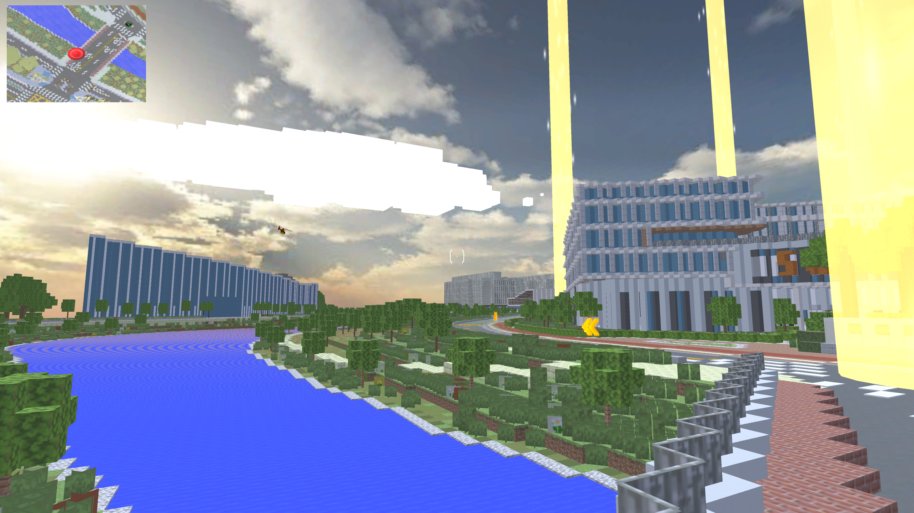
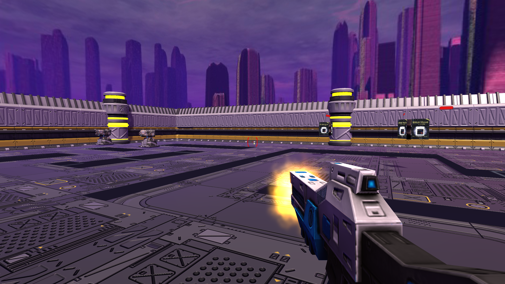

# SUSTECH-DEFENCE

A Tower Defence Game based on Unity 3D.

## Cooperators

[@Bugjudger](https://github.com/Bugjudger)

[@summinter](https://github.com/summinter)

[@Chuancey-Yu](https://github.com/Chuancey-Yu)

## Minecraft model of Sustech

+ Scale models of Southern University of Science and Technology based on minecraft are used

## Login and Archive

Complete login and archive function support.

## Random Map

A totally new map is generated for each battle.

## Combination of Third Person and First Person

Choose first person or third person

## Releases
Request [this url](https://github.com/yidaoxiangan/SUSTECH-DEFENCE/releases) for downloading our game or download [here](https://mega.nz/file/k0ZjSC6S#QVyoEhCwvyfTe0clOwG7P8sZh4Gzvg6mPxNgldvGgXM).

## Source Project
+ The size of soruce project is big so we put in on mega. You can download full project [here](https://mega.nz/file/AkBFHYoY#yKWCv1aHj6tMZx1TLwTCFiTNOCVwKEodf26mLfT2rgk).
